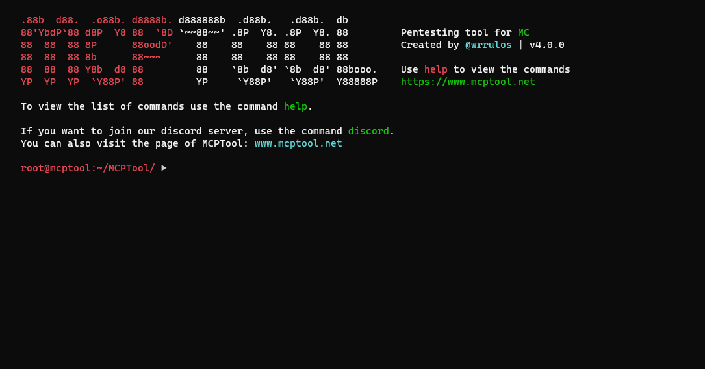
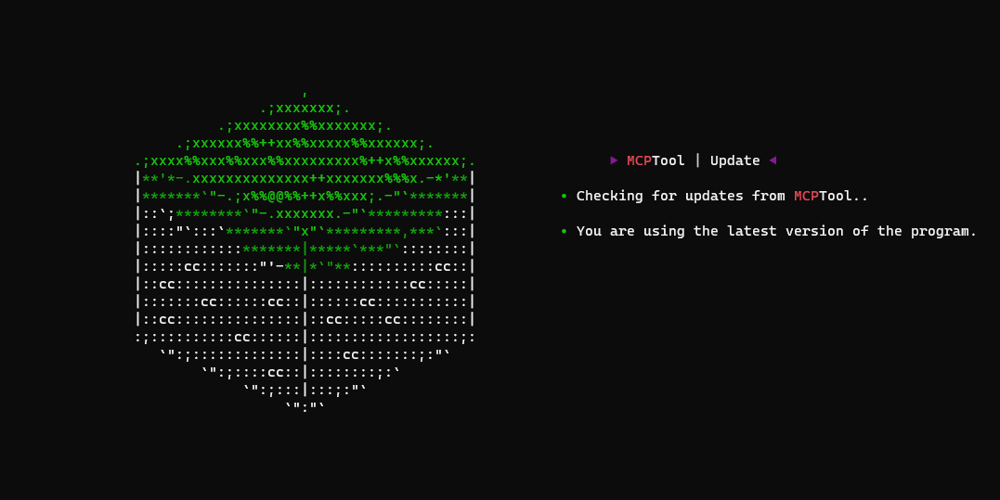
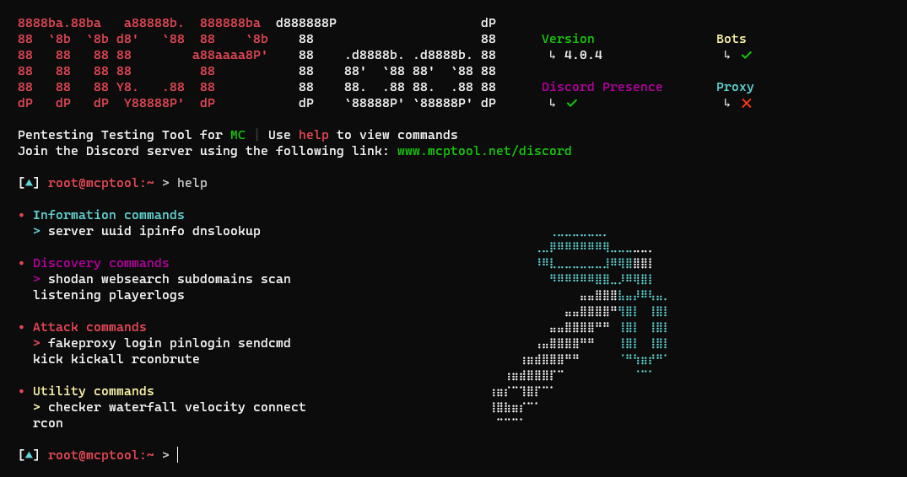

# 🧨  MCPTool v4.0.8

<h3> Pentesting tool for Minecraft </h3>
 

### This project was created for educational purposes and should not be used in environments without legal authorization.

# 🛠 Features

* See information of a server.
* View player information.
* Get information about an ip address.
* Obtain the domains associated with an IP address.
* Get the DNS records for a domain.
* Search random servers with certain information (With Shodan)
* Find minecraft servers on the most popular pages.
* Port scanning (with nmap and qubo). And send a bot to check if the server can be entered
* Get information from Minecraft servers found in a text file.
* Get the names and uuids of all players joining a server. (You can also get the date and time of entry and exit)
* Create a bungeecord (waterfall) and a local velocity.
* Use plugins found on proxy servers.
* Create a fake proxy server to capture data.
* Connect to a server using a bot.
* Connect to the RCON of a server and execute command.
* Initiate a brute force attack to access the console. (via RCON)
* Initiate a brute force attack to access the user's account. (via /login)
* Kick players by taking advantage of the "You logged in from a different location" error.
* Send a bot that will execute a list of commands upon login to the server.
* Bots are compatible with Proxies

## 💻 Supported operating systems:

* ✅ Windows (8, 8.1, 10 and 11)
* ✅ Linux
* ✅ Termux

## ⛏️ Supported minecraft versions

* 📃 1.8.x-1.20.x

## Available languages

- **EN**
- **ES**
- **FR**
- **SK**
- **TR**
- **DE**
- **CAT**
- **PT**

## 🔧 Installation 

Follow the steps in the [installation guide](./docs/es/instalation.MD).

## Commands

See the command guide from this [link.](./docs/es/commands.MD).

## 🕹 Usage

**python3 main.py**

## 📸 Screenshots

## 🎞 Video 

## Licencia 

MIT License

Copyright (c) 2023 Pedro Vega

Permission is hereby granted, free of charge, to any person obtaining a copy
of this software and associated documentation files (the "Software"), to deal
in the Software without restriction, including without limitation the rights
to use, copy, modify, merge, publish, distribute, sublicense, and/or sell
copies of the Software, and to permit persons to whom the Software is
furnished to do so, subject to the following conditions:

The above copyright notice and this permission notice shall be included in all
copies or substantial portions of the Software.

THE SOFTWARE IS PROVIDED "AS IS", WITHOUT WARRANTY OF ANY KIND, EXPRESS OR
IMPLIED, INCLUDING BUT NOT LIMITED TO THE WARRANTIES OF MERCHANTABILITY,
FITNESS FOR A PARTICULAR PURPOSE AND NONINFRINGEMENT. IN NO EVENT SHALL THE
AUTHORS OR COPYRIGHT HOLDERS BE LIABLE FOR ANY CLAIM, DAMAGES OR OTHER
LIABILITY, WHETHER IN AN ACTION OF CONTRACT, TORT OR OTHERWISE, ARISING FROM,
OUT OF OR IN CONNECTION WITH THE SOFTWARE OR THE USE OR OTHER DEALINGS IN THE
SOFTWARE.

 
