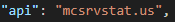

# MCPTool API Guide

APIs play a crucial role in MCPTool by enabling the querying and retrieval of data related to a Minecraft server. Currently, we have the following APIs available:

- [localhost](#localhost)
- [mcsrvstat.us](#mcsrvstat.us)
- [mcstatus.io](#mcstatus.io)

# Changing the API
If you wish to alter the API used by MCPTool, simply navigate to the configuration file located at `./config/config.json` and update the 'api' section with the name of the API you want to use.

## Localhost
The "localhost" method implements a local API using Flask. This local API allows for sending GET requests to obtain information about Minecraft servers.

## MCSrvstat.us
The "mcsrvstat.us" method utilizes the API provided by the website https://mcsrvstat.us/ to retrieve information about Minecraft servers.

## MCStatus.io
The "mcstatus.io" method utilizes the API provided by the website https://mcstatus.io/ to retrieve information about Minecraft servers.