# Complete guide on MCPTool commands

List of current MCPTool commands.

- [Server](#server)
- [Uuid](#uuid)
- [IPInfo](#ipinfo)
- [DNSLookup](#dnslookup)
- [Shodan](#shodan)
- [WebSearch](#websearch)
- [Subdomains](#subdomains)
- [Scan](#scan)
- [Listening](#listening)
- [PlayerLogs](#playerlogs)
- [FakeProxy](#fakeproxy)
- [Resolver](#resolver)
- [Login](#login)
- [PinLogin](#pinlogin)
- [SendCMD](#sendcmd)
- [Kick](#kick)
- [KickAll](#kickall)
- [RconBrute](#rconbrute)
- [Checker](#checker)
- [Waterfall](#waterfall)
- [Velocity](#velocity)
- [Connect](#connect)
- [Rcon](#rcon)

- [Discord](#discord)

## Server
The **server** command allows you to obtain information about a Minecraft server. Works on Java AND Bedrock servers.

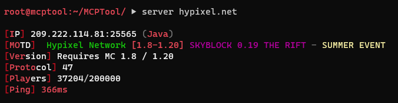

To use this command you must enter:
 
`server <ip:port/domain>`

## Uuid
The **uuid** command allows you to obtain the uuids of a Minecraft user.

To use this command you must enter:
 
`uuid <username>`

## IPInfo
The **ipinfo** command allows you to obtain information about an IP address.

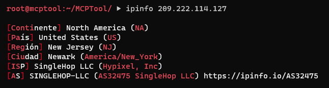

To use this command you must enter:
 
`ipinfo <ip>`

## DNSLookup
The **dnslookup** command allows you to obtain the DNS records for a specific domain.

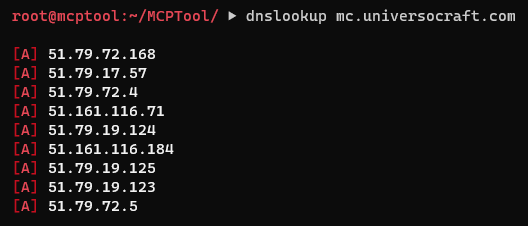

To use this command you must enter:
 
`dnslookup <domain>`

## Shodan
The **shodan** command uses the Shodan search engine to search for servers containing certain data.

**IMPORTANT!** To use this command you must enter a Shodan api key in the MCPTool configuration file.

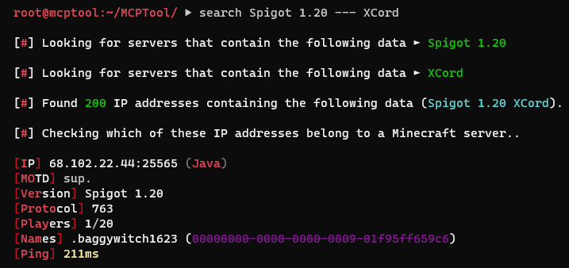

To use this command you must enter:
 
`shodan <datos>`

You can also enter multiple data in a single command to perform multiple searches. Data must be separated by **---**. Example:
 
`shodan spigot 1.8.8 --- spigot 1.19`

## WebSearch
The **websearch** command allows you to search for Minecraft servers that contain specific data on multiple pages.

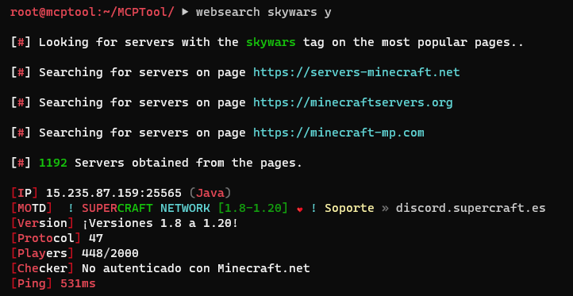

To use this command you must enter:
 
`websearch <tag>`

## Scan
The **scan** command allows you to perform a scan to look for open ports hosting Minecraft servers.

### **IP Range**
You can enter a normal IP like **127.0.0.1**.

But you can also enter an IP range, such as: **127.0.0.1-255**

Valid formats for IP ranges vary depending on the type of scanner you select.

### **Port Range**
You can enter a normal port like **25565**.

But you can also enter a variety of ports, such as: **25560-25570**

Valid formats for port ranges vary depending on the type of scanner you select.

### **Scanner**.
You can perform the scan using different scanners, this is specified in the **method** argument

List of methods:

- Nmap (0)
- Quboscanner (1)
- Masscan (2)

In the **method** argument you can enter the name of the scanner or its respective number.

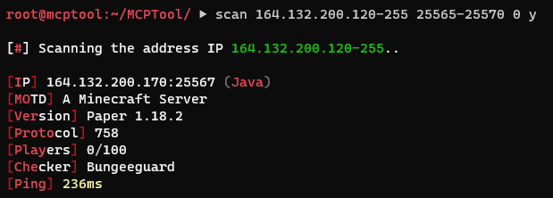
 
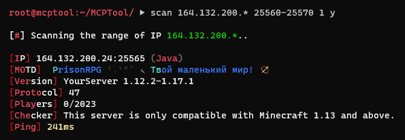
 

To use this command you must enter:
 
`scan <ip> <ports> <method>`

## Subdomains
The **subdomains** command allows you to get the subdomains of a domain.

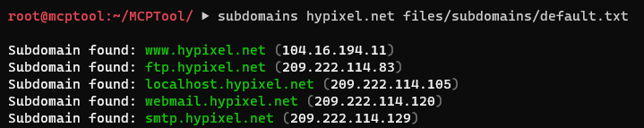

To use this command you must enter:
 
`subdomains <domain> <subdomainsFile>`

## Checker
The **checker** command allows you to obtain the current data from the servers located in a specific text file.

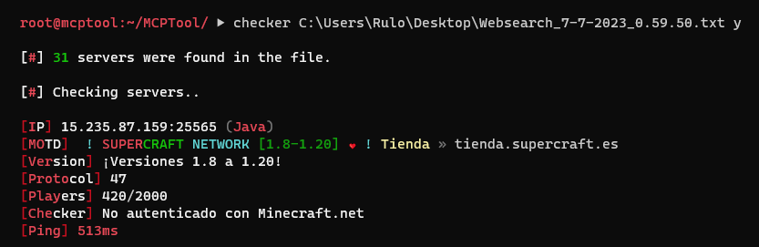

To use this command you must enter:
</b>
`checker <file>`

## Listening
The **listening** command allows you to get the list of players connecting to the server, along with their uuids.

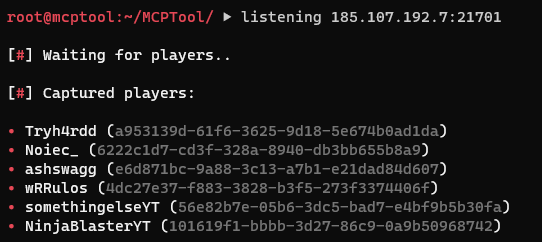

To use this command you must enter:
 
`listening <ip:port/domain>`

## Playerlogs
The **playerlogs** command is similar to the *listening* command, it allows you to get the date and time when users connect and disconnect from the specified server, along with their uuids.

To use this command you must enter:
 
`playerlogs <ip:port/domain>`

## Resolver
The **resolver** command allows you to obtain IP addresses and subdomains linked to the specified domain.

To use this command you must enter:
 
`resolver <domain>`

## Waterfall
The **waterfall** command creates a cascading proxy server that redirects to the specified server.

The proxy server comes with my *RBungeeExploit* plugin by default. This plugin allows you to run the following commands:

- /set-uuid -> Change your uuid.
- /connect -> Connects you to the specified server.

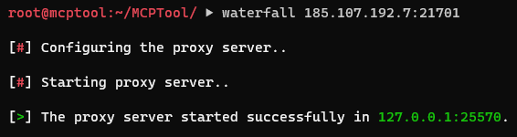
 

 
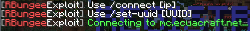

To use this command you must enter:
 
`waterfall <ip:port/domain>`

**NOTE** It is recommended to enter the IP and port of the server.

## Velocity
The **velocity** command creates a velocity proxy server that redirects to the specified server.

The proxy server comes with my *MCPTool* plugin by default. This plugin allows you to run the following commands:

- /username -> Change your username.
- /uuid -> Change your uuid.
- /connect -> Connects you to the specified server.

 

 
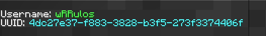
 
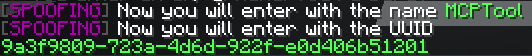

To use this command you must enter:
 
`velocity <ip:port/domain> <forwarding-mode>`

**NOTE** It is recommended to enter the IP and port of the server.

## Fake proxy
The **fakeproxy** command creates a speed proxy server that redirects to the specified server and captures all data. The data it saves is:

- Date and time of entry and exit of users.
- Username and IP address.
- Commands and messages sent.

In addition to saving data, it also allows you to interact with proxy users using commands.

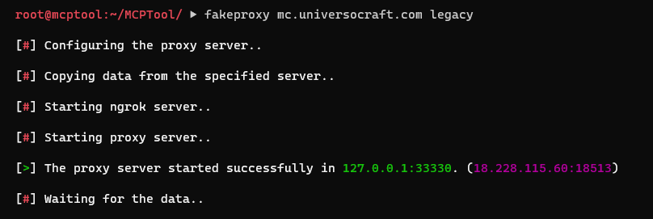

To use this command you must enter:
 
`fakeproxy <ip:port/domain> <forwarding-mode>`

**NOTE** It is recommended to enter the IP and port of the server.

## Connect
The **connect** command allows you to connect to a Minecraft server using the terminal.

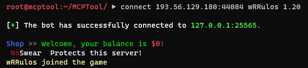

To use this command you must enter:
 
`connect <ip:puerto> <user> <version>`

## Rcon
The **rcon** command allows you to connect to a Minecraft server using rcon (only if enabled).

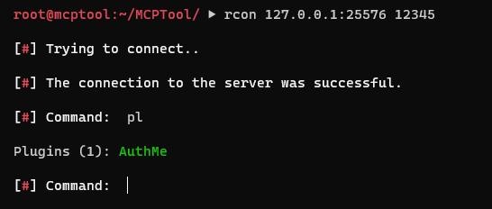

To use this command you must enter:
 
`rcon <ip:rconPort> <rconPassword>`

## RconBrute
The **rconbrute** command allows you to perform a brute force attack on the rcon port of the specified server to attempt to guess the password.

To use this command you must enter:
 
`rconbrute <ip:rconPort> <passwordFile>`

## Login
The **login** command allows you to perform a brute force attack on a Minecraft user within a non-premium server to try to guess their password. (/access)

**IMPORTANT!** I will give you a brief summary of how the bot works:

* When the bot connects to the server, it listens for any of the messages found in the **bruteforce_config** (*wordsToLogin*) configuration file.    After reading any of the words in that list, the bot runs the command to authenticate itself and then listens again, until it reads some of the words in (*wordsAtLogin*)

[!] If the bot doesn't try any passwords or if after trying one it doesn't do anything else, it's because you need to add more words to the corresponding lists.

To use this command you must enter:
 
`login <ip:port/domain> <username> <version> <passwordFile>`

## PinLogin
The **pinlogin** command allows you to perform a brute force attack on a Minecraft user within a server using the *AdvancedLogin* plugin, to attempt to guess their password.

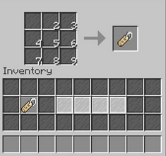

**NOTE** This command uses the same logic as the **[login](#login)** command, but instead of texts, they are titles.

To use this command you must enter:
 
`pinlogin <ip:port/domain> <username> <version> <digits>`

## Kick
The **kick** command allows you to connect a bot with a specific name. This is to disconnect you in case the server kicks players who log in from another location.

To use this command you must enter:
 
`kick <ip:port> <username> <version> <loop>`

**NOTE** In loop you must enter *y* or *n*.

## KickAll
The **kickall** command allows you to connect bots with the name of each player found on the server. This is to disconnect them in case the server kicks players who log in from another location.

To use this command you must enter:
 
`kickall <ip:port> <version> <loop>`

**NOTE** In loop you must enter *y* or *n*.

## SendCMD
The **sendcmd** command allows you to connect a bot that will send a list of messages or commands found in the specified text file.

To use this command you must enter:
 
`sendcmd <ip:port> <username> <version> <file> <loop>`

**NOTE** In loop you must enter *y* or *n*.

## Language
The **language** command allows you to change the language of the tool.

List of available languages:

- Spanish (**es**)
- English (**en**)
- Catalan (**cat**)
- German (**de**)
- French (**fr**)
- Portuguese (**pt**)
- Slovak (**sk**)
- Turkish (**tr**)

You must specify the language abbreviation, for example **es**.

To use this command you must enter:
 
`language <language>`

## Discord
The **discord** command shows the link for my discord server.

To use this command you must enter:
 
`discord`
