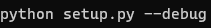

# Guía de instalación de MCPTool

#### MCPTool está programada en Python y NodeJS, pero también usa otras aplicaciones para ciertas funciones. Para usar MCPTool debe instalar lo siguiente:

* Python 3
* NodeJS (Recomendado)
* Java 17 o superior. (Recomendado)
* Nmap (Opcional)
* Masscan (Opcional)
* Ngrok (Opcional)

 

# Instalación automatica
Ejecuta **python setup.py**. (Tenga en cuenta que la variable de python puede variar según su sistema)

### Modo DEBUG

Si desea ejecutar **setup.py** en modo debug, debe agregar el siguiente parametro: *--debug*

# Instalación manual.

## Python 3

## Windows

Para instalar *Python 3* en **Windows** debe descargar la última versión desde su página oficial: https://www.python.org/

## Linux

Puede instalar python3 usando el gestor de paquetes **apt**.

`sudo apt install python3-pip`

## Termux

`pkg install python3`

 

## NodeJS

**¡IMPORTANTE!** Debe instalar la versión recomendada de NodeJS.

## Windows

Para instalar *NodeJS* en **Windows** debe descargar la última versión desde su página oficial: https://nodejs.org/es/

## Linux

Puede instalar nodejs usando el gestor de paquetes **apt**.

`sudo apt install nodejs -y`
`sudo apt install npm -y`

## Termux

`pkg install nodejs -y`

 

## Java 17

## Windows

Para instalar *Java 17* en **Windows** debe descargar la última versión desde su página oficial: https://www.oracle.com/java/technologies/javase/jdk17-archive-downloads.html

## Linux

Puede instalar nodejs usando el gestor de paquetes **apt**.

`sudo apt install openjdk-17-jdk openjdk-17-jre`

## Termux

`pkg install openjdk-17 -y`

 

## Nmap

## Windows

Para instalar *Nmap* en **Windows** debe descargar la última versión desde su página oficial: https://nmap.org/download.html

## Linux

Puede instalar nodejs usando el gestor de paquetes **apt**.

`sudo apt-get install nmap`

## Termux

`pkg install nmap -y`

## Ngrok

 

## Windows

Para instalar *Ngrok* en **Windows** debe descargar la última versión desde su página oficial: https://ngrok.com/download

## Linux

Puede instalar nodejs usando el gestor de paquetes **apt**.

`curl -s https://ngrok-agent.s3.amazonaws.com/ngrok.asc | sudo tee /etc/apt/trusted.gpg.d/ngrok.asc >/dev/null && echo "deb https://ngrok-agent.s3.amazonaws.com buster main" | sudo tee /etc/apt/sources.list.d/ngrok.list && sudo apt update && sudo apt install ngrok`

## Termux

`pkg update && pkg upgrade -y | pkg install zip wget -y | wget https://bin.equinox.io/c/4VmDzA7iaHb/ngrok-stable-linux-arm.zip | unzip ngrok-stable-linux-arm.zip | chmod +x ngrok`

 

## Masscan
https://github.com/robertdavidgraham/masscan
